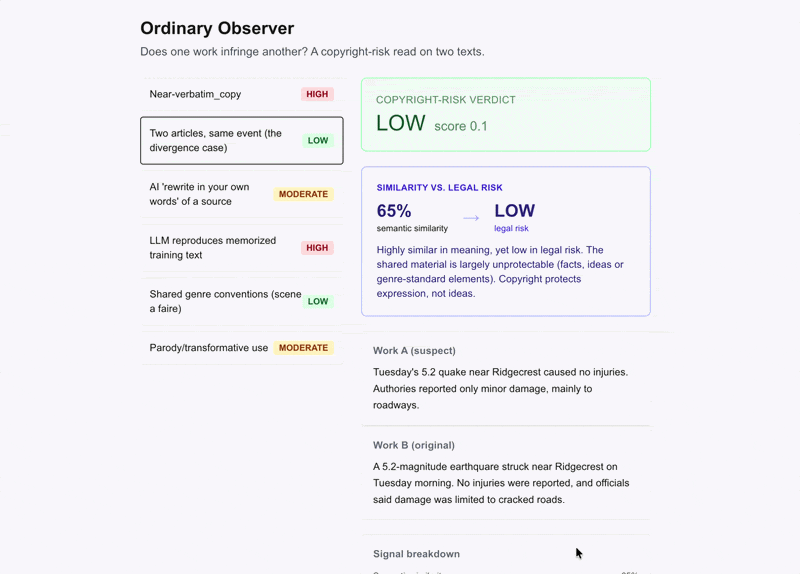

# Ordinary Observer

**Live demo → https://ordinary-observer.vercel.app/**



My grandfather is convinced that because I'm a legal studies minor, I know everything about the law. Spoiler alert: I don't. But he kept asking me the same question every time we saw each other, *how is anyone ever going to regulate AI?*, and I kept not having a good answer for him.

So I went looking for one. Or at least a small corner of one. The corner I picked is copyright, because that's where the fight is actually happening right now:
[the NYT suing openAI](https://harvardlawreview.org/blog/2024/04/nyt-v-openai-the-timess-about-face/),
[Getty suing Stability AI over an image generator](https://www.mayerbrown.com/en/insights/publications/2025/11/getty-images-v-stability-ai-what-the-high-courts-decision-means-for-rights-holders-and-ai-developers),
[a legal-research startup sued for copying Westlaw](https://www.courthousenews.com/ai-company-argues-its-use-of-scraped-westlaw-legal-data-was-transformative/).
Slightly on the nose: the model doing the legal reads here is Claude, whose maker Anthropic just settled the largest copyright case in US history - [$1.5B, *Bartz v. Anthropic*](https://authorsguild.org/advocacy/artificial-intelligence/what-authors-need-to-know-about-the-anthropic-settlement/) - over the books it trained on. I'll let you sit with that.

Every one of those cases hinges on the same deceptively simple question: *when is something similar enough to be infringing?* And I realized I couldn't answer it either. This is my attempt at exploring (and maybe kind of answering it) in code.

It was also my excuse to get my two majors in the same room: the CS and cog sci background that let me build it, and the legal studies my grandfather is so sure I've mastered.

Ordinary Observer takes two pieces of text and estimates the copyright-infringement risk of one against the other. The name is the [legal test itself](https://en.wikipedia.org/wiki/Substantial_similarity): infringement is judged by whether an *"ordinary observer"* would perceive one work as having copied another.

> ⚠️ Not legal advice. Still not a lawyer, Popop.

## The thing that makes this interesting
You'd think "how similar are these two texts" is the whole problem. It isn't. Copyright doesn't protect *ideas or facts*, only the specific *expression*. So two new articles about the same earthquake can be ~85% similar and completely fine, while a careful paraphrase of a novel can be risky even though it barely shares any exact words.

That gap between "how similar it looks" and "how risky it actually is" is the whole project. My first scoring model completely missed it (more on that below). and fixing that was the most fun part of building this.


## How it works
- **Similarity** - runs locally, sentence embeddings for meaning, plus n-gram and fuzzy matching for literal copying. No API, no cost.
- **The legal read** - where an LLM earns its keep, sorts the shared material into "protectable expression" vs. "just facts/ideas/genre cliches," and writes a plain-English verdict.
- **The score** - deliberately dumb and transparent, I'd rather you be able to see exactly why it said HIGH than trust a black box, treats infringement as the bigger of two risks (copying words, or copying protected expression in different words).

Fair use I decided to *not* score. The tool flags it ("hey, this looks like parody") but won't pretend to decide it. Fair use is the messiest question of copyright and I wasn't going to have a side project rule on it (yet).

## The part I'm oddly proud of
My first risk formula leaned 60% on verbatim word overlap. Which meant a *paraphrase* (someone reqording copyrighted text, i.e. exactly what an LLM does) could barely score above "low risk." That's backwards: paraphrasing is the whole reason this tool should exist. I reqrote the scoring to weight non-literal copying properly. That story, and a few others, are in [DECISIONS.md](DECISIONS.md)

## Runs on nothing
The expensive part (the LLM calls) happens just once when I build it, and the results get cached to the repo. The live site is just static files reading a JSON, no server, no database, no API key. You can clone it and it just works, and it costs me $0 to keep up. That was a design goal, not an accident: a compliance tool nobody can affort to run doesn't get used.

## Try it locally
```bash
python3 -m venv .venv && source .venv/bin/activate
pip install -r requirements.txt
python -m scripts.build_showcases #runs from cache, no key needed

cd web && npm install && npm run dev #http://localhost:3000
```

## Analyze your own text
The built-in examples are cached and run with no key. To analyze *your own* pair, save two text files and run:
```bash
python -m scripts.analyze suspect.text original.txt
```
This is a fresh analysis, so it calls the Anthropic API (1-2 cents per run) and needs a personal key in a `.env` file:
```
ANTHROPIC_API_KEY=sk-ant-your-key-here
```
Get one at [console.anthropic.com](https://console.anthropic.com). Re-running the same pair is free, results are cached to disk.

## Where it breaks (because everything does)
- It'd wrongly flag someone for copying *facts* verbatim (like a phone book or something). Real law (*Feist v. Rural*) says that's fine, but my literal-copy signal doesn't know that yet.
- It only does text. No images, audio clips, or code (yet).
- The verdicts are model-generated risk rignals I tuned on a handful of cases, not all of them. If I keep going, I want to test it against a full set of real decided cases.

## Tech
Python - `sentence-transformers` (local, no API) - `rapidfuzz` - `numpy` - Anthropic API (cached) - Next.js - Tailwind - Vercel

